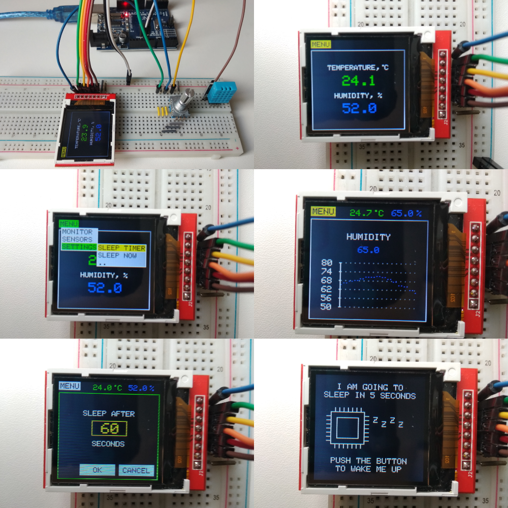

# simple_weather_station
This "device" is a simple weather station, based on Arduino Uno, DHT-11 temperature and humidity sensor, EC11 incremental encoder and TFT ST7735R display. The device indicates current temperature and humidity and also builds graphs of parameters changes. Power save mode is available and its timer is customizable.
This is my final project for module "Devices design on Arduino" of "Embedded Systems Developer" training course.
Unfortunately there are many known problems using classes and polymorphism in Arduino sketches despite using C++ as programming language. That's why I was forced to use procedural approach and structures instead of OOP. Using OOP would make the code more elegant and compact.

